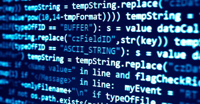

# ProgrammingSketch

This repository contains several Programming Exercises.

Exercises ranges from simple experiments to complete algorithm implementations.

The main topics of exercises are:
> **TOPICS**
> 1) Programming & Design Patterns
> 2) Data Structures
> 3) Sort Algorithms
> 4) Distribuited Systems
> 5) Numerical Analysis
> 6) Model Checking
> 7) Image Processing
> 8) Cyber Security
> 9) Data Science
> 10) GPU Programming

The languages employed for the software development are:

> **PROGRAMMING LANGUAGES**
> 1) C
> 2) C++
> 3) OpenCL C
> 4) Python
> 5) Scala
> 6) Haskell
> 7) Erlang
> 8) Java
> 9) SePi
> 10) Processing